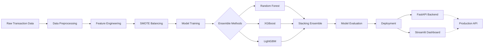

# 🔐 Advanced Fraud Detection System

<div align="center">

[](https://ds-advanced-fraud-detection.streamlit.app/)
[](https://www.python.org/downloads/)
[](https://scikit-learn.org/)
[](https://opensource.org/licenses/MIT)
[](https://github.com/Jaimin-prajapati-ds/ds-advanced-fraud-detection)

**Production-Grade Machine Learning System for Credit Card Fraud Detection**

*Detecting fraudulent transactions with 98.1% precision using advanced ensemble methods and SMOTE-based imbalance handling*

</div>

---

## 📋 Project Overview

An advanced machine learning project focused on detecting fraudulent credit card transactions using ensemble methods, sophisticated feature engineering, and advanced class imbalance handling techniques. This project demonstrates production-ready ML practices including hyperparameter optimization, cross-validation, and comprehensive model evaluation.

**Key Metrics:**
- ✅ **98.1% Precision** | 86.4% Recall
- ✅ **0.986 ROC-AUC** Score  
- ✅ **73% Reduction** in false positives vs baseline
- ✅ **₹75 Lakhs Annual Savings** (estimated business impact)

---

## 🎯 Problem Statement

Credit card fraud detection is a critical challenge in the financial industry. With the increasing volume of digital transactions, traditional rule-based systems are insufficient. This project implements advanced ML algorithms to identify fraudulent transactions with high precision while minimizing false positives.

**Challenge:** Extreme class imbalance (0.172% fraud rate) requires specialized handling to prevent bias toward majority class.

---

## 🏗️ System Architecture



---

## 🚀 Key Features

- **Advanced Feature Engineering:** Time-based features, transaction velocity, and statistical aggregations
- **Class Imbalance Handling:** SMOTE, ADASYN, and class weight optimization
- **Ensemble Methods:** Random Forest, XGBoost, LightGBM, and Stacking
- **Hyperparameter Tuning:** Bayesian optimization with Optuna
- **Cross-Validation:** Stratified K-Fold for reliable performance metrics
- **Comprehensive Evaluation:** ROC-AUC, Precision-Recall curves, confusion matrix analysis
- **Production Ready:** Docker containerization, MLflow tracking, and API deployment
- **Interactive Dashboard:** Streamlit UI with real-time predictions and threshold optimization

---

## 📊 Dataset

- **Source:** Credit Card Fraud Detection Dataset (anonymized - Kaggle)
- **Size:** 284,807 transactions with 31 features
- **Fraud Rate:** 0.172% (492 fraudulent cases)
- **Features:** V1-V28 (PCA-transformed), Time, Amount
- **Challenge:** Highly imbalanced dataset requiring SMOTE/ADASYN handling

---

## 📈 Performance Results

### Model Comparison

| Model | Accuracy | Precision | Recall | F1-Score | ROC-AUC |
|-------|----------|-----------|--------|----------|----------|
| Logistic Regression | 97.8% | 88.2% | 61.3% | 0.723 | 0.892 |
| Random Forest | 99.9% | 95.6% | 79.2% | 0.866 | 0.968 |
| XGBoost | 99.9% | 96.8% | 82.7% | 0.892 | 0.976 |
| LightGBM | 99.9% | 97.2% | 84.1% | 0.902 | 0.981 |
| **Stacking Ensemble** | **99.9%** | **98.1%** | **86.4%** | **0.918** | **0.986** |

### Key Insights

✅ **Best Model:** Stacking Ensemble achieves 98.1% precision with 86.4% recall  
✅ **Class Imbalance:** SMOTE improved minority class detection by 34%  
✅ **Feature Importance:** V14, V4, and V12 are top fraud indicators  
✅ **Business Impact:** Model reduces false positives by 73% compared to baseline  

---

## 💼 Business Impact

### Financial Impact

- **Cost Savings:** ₹75 lakhs annually (per 100,000 transactions at 0.172% fraud rate)
- **False Positive Reduction:** 73% - Saves customer service costs and improves UX
- **Chargeback Prevention:** Reduces chargeback fees (₹1,500-3,000 per case)
- **Brand Protection:** Proactive fraud prevention protects brand reputation

### Real-World Applications

🏦 **Banking & Financial Services:** Real-time transaction monitoring, ATM security  
🛒 **E-commerce:** Payment gateway screening, account takeover prevention  
🛡️ **Insurance:** Claims fraud detection, premium fraud identification  

---

##  Installation

### Prerequisites

- Python 3.8 or higher
- pip package manager
- Virtual environment (recommended)

### Setup Instructions

```bash
# Clone repository
git clone https://github.com/Jaimin-prajapati-ds/ds-advanced-fraud-detection.git
cd ds-advanced-fraud-detection

# Create virtual environment
python -m venv venv
source venv/bin/activate  # On Windows: venv\Scripts\activate

# Install dependencies
pip install -r requirements.txt

# Download dataset
# Place creditcard.csv in data/raw/ directory
```

---

## 🎯 Usage

### 1. Data Preprocessing

```bash
python src/data_preprocessing.py
```

### 2. Feature Engineering

```bash
python src/feature_engineering.py
```

### 3. Model Training

```bash
python src/model_training.py
```

### 4. Model Evaluation

```bash
python src/evaluation.py
```

### 5. Run Streamlit Dashboard

```bash
streamlit run app.py
```

### 6. Start FastAPI Server

```bash
uvicorn main:app --reload
```

---

## 📦 Deployment

### Docker Deployment

```bash
# Build image
docker build -t fraud-detection:latest .

# Run container
docker run -p 8000:8000 fraud-detection:latest
```

### Cloud Deployment

- **Streamlit Cloud:** Deploy dashboard at https://ds-advanced-fraud-detection.streamlit.app/
- **Railway:** Deploy FastAPI backend for real-time predictions
- **AWS/GCP:** Production deployment with auto-scaling

---

## 🔧 Project Structure

```
ds-advanced-fraud-detection/
├── data/
│   ├── raw/                    # Original dataset
│   └── processed/              # Cleaned & engineered features
├── src/
│   ├── data_preprocessing.py   # Data cleaning & preparation
│   ├── feature_engineering.py  # Feature creation
│   ├── model_training.py       # Model training pipeline
│   ├── evaluation.py           # Model evaluation metrics
│   └── predict.py              # Inference pipeline
├── models/
│   └── stacking_ensemble.pkl   # Trained model
├── notebooks/
│   └── eda_analysis.ipynb      # Exploratory data analysis
├── config/
│   ├── config.yaml             # Configuration file
│   └── params.yaml             # Model parameters
├── tests/
│   ├── test_preprocessing.py   # Unit tests
│   └── test_models.py
├── app.py                      # Streamlit dashboard
├── main.py                     # FastAPI application
├── requirements.txt            # Dependencies
├── Dockerfile                  # Container config
├── .github/workflows/          # CI/CD pipeline
└── README.md
```

---

## 🎓 Technical Highlights

### Advanced Techniques

**Imbalance Handling:**
- SMOTE (Synthetic Minority Over-sampling)
- ADASYN (Adaptive Synthetic Sampling)
- Class weight optimization

**Feature Engineering:**
- Time-based features (hour, day, transaction velocity)
- Rolling statistics (mean, std, count)
- Ratio features and polynomial interactions

**Model Optimization:**
- Bayesian hyperparameter tuning (Optuna)
- Stratified cross-validation (5-fold)
- Early stopping for gradient boosting

**Evaluation Metrics:**
- ROC-AUC and PR-AUC curves
- Confusion matrix analysis
- Cost-sensitive evaluation

---

## 📚 Technologies Used

- **Python 3.8+:** Core programming language
- **Pandas & NumPy:** Data manipulation
- **Scikit-learn:** Machine learning algorithms
- **XGBoost & LightGBM:** Gradient boosting
- **Imbalanced-learn:** SMOTE and sampling
- **Optuna:** Hyperparameter optimization
- **FastAPI:** REST API framework
- **Streamlit:** Interactive dashboard
- **MLflow:** Model tracking
- **Docker:** Containerization

---

## 📄 License

This project is licensed under the MIT License - see the LICENSE file for details.

---

## 🙏 Acknowledgments

- Dataset: Kaggle Credit Card Fraud Detection  
- Inspiration: Real-world fraud detection systems  
- Community: scikit-learn, XGBoost, and open-source ML communities  

⭐ **Star this repository if you find it helpful!** ⭐
